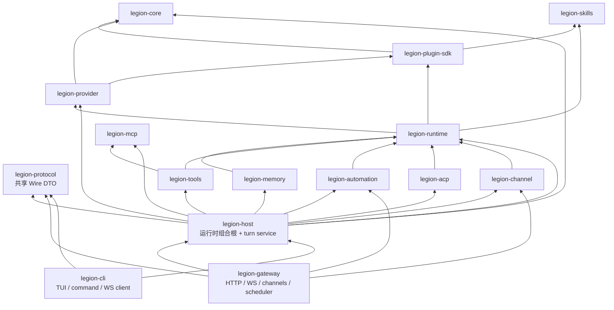

# Host / Protocol 分层迁移计划

> **状态**：Phase 0–3 已完成（2026-07-14）  
> **优先级**：P1（架构演进地基）  
> **预估规模**：L（跨 3–5 个 crate，建议拆分为 4 个可独立合并的阶段）  
> **前置条件**：无；现有测试套件是迁移的行为基线  
> **目标**：解除 CLI 对 Gateway 实现层的依赖，将“运行时装配”和“Wire 协议”变成可被 Gateway 与 CLI 共同使用的稳定边界。  
> **实施范围**：Phase 0–3 已完成；Phase 4 及以后的独立发布、按需安装、升级回滚见 [CLI / Gateway 独立发布设计](./cli-gateway-independent-distribution.md)。

> 后续独立发布、按需下载、协议协商与升级回滚的完整设计见[《CLI / Gateway 独立发布、按需安装与兼容性设计》](./cli-gateway-independent-distribution.md)。本计划完成 Phase 1–3 后，才具备安全实施该方案的 crate 边界。

---

## 1. 背景与问题定义

Legion 已同时支持两种运行方式：

- Gateway 模式：CLI 通过 WebSocket 调用长驻 Gateway。
- Embedded 模式：CLI 在进程内构造运行时，直接驱动一次 agent turn。

两种模式需要共享相同的运行时装配、会话恢复和事件语义。现有实现通过 `legion-gateway::host::AgentHost` 达成复用，但该选择让 CLI 依赖 Gateway crate：

```text
legion-cli ──→ legion-gateway ──→ runtime / tools / memory / …
```

这不是 Cargo 的循环依赖；`cargo metadata` 显示当前依赖图仍是 DAG。问题是**架构层次反向**：CLI 为了本地运行而依赖一个本应只承载 HTTP/WS、渠道启动和服务进程生命周期的分发层。

### 1.1 现状证据

| 证据 | 直接说明 |
|---|---|
| `crates/legion-cli/Cargo.toml:12` | CLI 直接依赖 `legion-gateway`。 |
| `crates/legion-cli/src/driver.rs:15-18` | LocalDriver 使用 Gateway 的 `WsFrame`、`agent_rpc`、`host::AgentHost` 和 `SessionStore`。 |
| `crates/legion-gateway/src/host.rs:44-64` | `AgentHost` 同时拥有 runtime、session、router、MCP、插件与 cron store，是跨 transport 的运行时组合根。 |
| `crates/legion-gateway/src/host.rs:67-248` | `AgentHost::new` 负责插件、MCP、provider、memory、tools、harness、subagent、swarm、messenger 的装配。 |
| `crates/legion-gateway/src/host.rs:253-371` | 会话恢复与事件转发实现混用 `AgentParams`、`WsFrame`，使 Host 不能直接移出 Gateway。 |
| `crates/legion-gateway/src/gateway.rs:61-174` | Gateway 在 Host 之上增加渠道启动、HTTP/WS、自动化和节点管理，符合“分发层”的角色。 |

### 1.2 当前结构的具体成本

1. Gateway 的任何 HTTP/WS 依赖变化都会扩大 CLI 的编译与耦合面。
2. 嵌入模式测试为了替换 runtime，会构造 Gateway Host，再覆盖其公开字段；这说明组合根和 transport 测试替身混在一起。
3. `WsFrame` 是传输表示，却被 embedded CLI 用作内部事件载体；未来增加非 WebSocket 前端时会继续传播该耦合。
4. Host 的职责已经跨越了“网关”，名称和 crate 位置会误导后续功能继续放进 Gateway。

---

## 2. 目标、非目标与不变量

### 2.1 目标

1. 新建 `legion-host`，成为运行时组合根；Gateway 和 CLI 都依赖它。
2. 新建 `legion-protocol`，承载双方共享的 WebSocket DTO；CLI 不再依赖 `legion-gateway`。
3. Gateway 保留网络服务、渠道生命周期、HTTP/WS handler、运营调度与节点管理。
4. 保持 gateway 与 embedded 模式的运行语义、transcript 写入顺序和 agent 事件 payload 完全兼容。
5. 每一阶段均可单独编译、测试、回滚；不要求一次重写运行时。

### 2.2 非目标

- 不在本迁移中改变 agent loop、tool policy、provider 路由、session 文件格式或配置 schema。
- 不在本迁移中把所有 WebSocket RPC 都抽象成通用应用服务；仅抽出 CLI 与 Gateway 共同使用的 agent-run 路径和协议 DTO。
- 不在本迁移中实现动态插件、重做插件注册表、替换 ContextEngine，或改变插件能力模型。
- 不要求把 `legion-channel` 从 runtime 依赖中再拆一次；那是独立的 inbound application service 议题。

### 2.3 必须保持的不变量

| 不变量 | 验证方式 |
|---|---|
| 默认配置、CLI 参数与 Gateway WS 协议不变 | 现有 CLI / WS 集成测试不改调用形态。 |
| 本地和 Gateway 的 `RunEvent` payload 相同 | 为同一 fake harness 断言逐帧 JSON 相等。 |
| transcript 的 user、tool、compaction boundary、resume head 与 final history 写入顺序不变 | SessionStore fixture 做字节级/JSONL 语义对比。 |
| `--yolo`、approval、`--dump-prompts`、`--session` 行为不变 | Driver 与 websocket 回归测试。 |
| Gateway 启动的渠道与自动化后台任务仍只在 Gateway 模式启动 | Host 单测与 Gateway 集成测试。 |

---

## 3. 目标架构

### 3.1 目标依赖图



`legion-host` 是有意的“聚合型 crate”：它依赖多个基础能力以装配一套可运行 agent，但它不依赖 `axum`、`tokio-tungstenite`、Web dashboard 或 Gateway handler。

### 3.2 crate 职责划分

| crate | 迁移后负责 | 明确不负责 |
|---|---|---|
| `legion-protocol` | `WsFrame`、连接握手 DTO、agent RPC 请求/响应 DTO、稳定的 JSON 编解码辅助函数 | socket 读写、认证、RPC method dispatch、业务逻辑。 |
| `legion-host` | `AgentHost`、系统插件装配、provider/memory/MCP/tools/harness 装配、session 恢复/修复、turn 事件持久化与 transport-neutral event sink | HTTP 路由、WebSocket 生命周期、渠道 start/stop、cron/heartbeat/task runner 的后台 loop。 |
| `legion-gateway` | Axum router、WebSocket dispatch、认证/配对、启动/停止渠道、启动/停止自动化 loop、HTTP webhook、节点与 market HTTP/RPC 入口 | AgentRuntime 的具体装配、CLI embedded 特有逻辑。 |
| `legion-cli` | TUI、CLI 命令、Gateway WebSocket client、embedded LocalDriver 的 approval UI | Gateway 的 runtime 组装或 WebSocket 数据结构定义。 |

### 3.3 Host 对外 API（目标形态）

Host 不应向调用方暴露 `WsFrame`。它应使用 Runtime 的 `RunEvent` 作为核心事件，并将持久化的输出交给调用方处理：

```rust
pub struct PreparedRun {
    pub stream: RunStream,
    pub accepted: AgentAccepted,
    pub session_key: String,
    pub user_content: String,
}

pub struct AgentHost { /* 组合后的依赖 */ }

impl AgentHost {
    pub async fn new(config: Config) -> Result<Self, HostError>;

    pub async fn prepare_run(
        &self,
        params: AgentParams,
        approval_gate: Option<Arc<ApprovalGate>>,
    ) -> Result<PreparedRun, HostError>;

    pub async fn drive_prepared_run(
        &self,
        prepared: PreparedRun,
        emit: impl FnMut(RunEvent),
    );
}
```

Gateway 将 `RunEvent` 编码为 `WsFrame::event("agent", run_event_to_payload(...))`；CLI embedded 模式使用**同一个 protocol encoder**。这样事件 JSON 保持一致，但 Host 不再知道 WebSocket。

`drive_prepared_run` 的第一版可继续拥有 transcript 追加和 `SessionAccumulator`，以保证迁移最小化。后续若需要 HTTP/SSE/CLI 以外的 transport，再考虑把它重命名为 `TurnService`。

### 3.4 协议边界（目标形态）

第一版 `legion-protocol` 只迁移已被 CLI 直接消费的稳定类型：

```text
legion-protocol/src/
├── lib.rs          # re-export
├── websocket.rs    # WsFrame, ConnectParams, AuthCreds, HelloPayload, Features
└── agent.rs        # AgentParams, UserMessage, AgentAccepted, agent event payload DTO
```

`AgentParams` 当前包含 `Vec<legion_provider::types::ChatMessage>`。迁移时有两种路径：

- **阶段 1 选择（推荐）**：`legion-protocol` 依赖 `legion-provider`，保持 JSON 与类型不变，降低迁移风险。
- **后续可选优化**：新增 protocol 专用 `HistoryMessage`，在 Host 边界转换，进一步降低 protocol 对 provider 的依赖；这是兼容性风险较高的第二次演进，不纳入本计划的完成条件。

---

## 4. 迁移策略与阶段计划

### Phase 0：建立基线与防回归护栏

**目的**：在移动代码前锁定现有行为。

1. 在 `legion-cli` 增加一组 LocalDriver / WsDriver 对比测试：同一 fake `Harness`、同一 `AgentParams` 下，断言 agent event JSON 序列一致。
2. 在 `legion-gateway` 为 `prepare_run` + `drive_run_stream` 建立 session fixture：覆盖普通回答、工具调用、compaction boundary、终止事件。
3. 给 `AgentHost::new` 当前装配内容建立表格型测试断言：plugin registry、MCP tool merge、agent router、memory backend、ACP harness、subagent/spawner 是否存在。
4. 记录当前构建矩阵：

```bash
cargo fmt -- --check
cargo clippy --workspace --all-targets
cargo test --workspace --all-targets
```

**完成条件**：先增加测试而不改变生产依赖图；每个 fixture 在迁移后继续使用。

### Phase 1：抽出 `legion-protocol`（无行为变化）

**目的**：先解除共享 DTO 的归属错误，为 Host 抽取去除 `WsFrame`/`AgentParams` 障碍。

1. 添加 workspace member `crates/legion-protocol`，只依赖 `serde`、`serde_json`，以及第一版所需的 `legion-provider`。
2. 将下列纯 DTO 从 Gateway 移入 protocol：
   - `message.rs` 中的 `WsFrame`、`ConnectParams`、`AuthCreds`、`HelloPayload`、`Features`；
   - `agent_rpc.rs` 中的 `AgentParams`、`UserMessage`、`AgentAccepted`；
   - 若 `run_event_to_payload` 只做 DTO 转换，也一并迁移；若混有 Gateway 业务逻辑，则先保留业务函数并只迁移输出 struct。
3. Gateway 改为 `pub use legion_protocol::…`，保留一个 release 周期的兼容 re-export，避免内部与下游用户一次性断裂。
4. CLI 改从 `legion-protocol` 导入 DTO；此时它仍暂时依赖 Gateway 的 Host 和 stream driver。
5. 为 `WsFrame` 与 agent 请求/响应添加 JSON round-trip 与既有 JSON fixture 兼容测试。

**不做的事**：不移动 WebSocket handler、认证、`dispatch_request`，不重命名 wire 字段。

**完成条件**：`legion-cli/Cargo.toml` 对 `legion-gateway` 的依赖仍存在，但不再因 DTO 而存在；Gateway WebSocket 测试与 CLI client 测试均通过。

### Phase 2：抽出 `legion-host` 的运行时组合根

**目的**：将跨 transport 的装配和会话运行逻辑移出 Gateway。

1. 添加 workspace member `crates/legion-host`，初始依赖集合与当前 `legion-gateway/src/host.rs` 等价。
2. 原样迁移并按职责拆成小模块：

```text
legion-host/src/
├── lib.rs
├── host.rs             # AgentHost 和公开 API
├── assembly.rs         # provider/memory/MCP/tools/harness 装配
├── turn.rs             # prepare_run、event persistence、SessionAccumulator
├── system_plugins.rs   # 内置 plugin 与 channel provider 实例装配
├── session.rs          # SessionStore、transcript repair（可先原样迁入）
├── routing.rs          # session key → agent binding
├── agent_messenger.rs  # RuntimeAgentMessenger
├── image_tool.rs
├── tts_tool.rs
└── error.rs
```

3. 迁移范围以现有 Gateway 中的跨 transport 文件为准：
   - `host.rs`；
   - `session_store.rs`、`transcript_repair.rs`、`routing.rs`、`agent_messenger.rs`；
   - gateway 注册的 session/image/TTS tools；
   - `plugins.rs` 中“构建系统插件实例”的部分。
4. `SystemPlugins` 仍返回各渠道的具体 `Arc`，供 Gateway 启动/停止；Host 只**构造**它们，不调用 `start` / `stop`。
5. 将 `prepare_run` 改为仅依赖 `legion-protocol::AgentParams` 和 Host 自身类型；移除对 Gateway module path 的引用。
6. 将 `drive_run_stream` 改为 `RunEvent` sink；Gateway/CLI 使用 protocol encoder 适配为 `WsFrame`。
7. Gateway 改为依赖 Host，`Gateway::new` 只从 Host 获取 runtime/session/router/registry/MCP 与已构造的渠道实例。
8. 保留 Gateway 的 `pub use legion_host::AgentHost` 一个兼容周期，并标注 deprecated（若项目有公开 crate API 承诺）；内部代码不得继续引用 `crate::host`。

**关键约束**：Phase 2 是文件搬迁加最小 API 适配，不改变启动顺序。尤其保持以下顺序：插件初始化 → MCP 加载 → provider/memory → cron store → 工具注册 → runtime/harness → late-bound spawner/swarm/messenger。

**完成条件**：`legion-gateway` 不再包含 `host.rs` 或 runtime 组装函数；`Gateway::new` 仍能启动同一套渠道和自动化服务。

### Phase 3：CLI 切换到 Host 与 Protocol，移除 Gateway 依赖

**目的**：解除最终反向依赖。

1. `LocalDriver` 改用 `legion_host::AgentHost` 与 `legion_host::PreparedRun`。
2. `WsDriver` 改用 `legion_protocol::WsFrame`；连接 URL、socket 读写仍由 CLI 自己实现。
3. 将 CLI 中 Gateway 依赖拆分：

| 当前用途 | 迁移后来源 |
|---|---|
| `WsFrame` | `legion-protocol` |
| `AgentParams` / `UserMessage` | `legion-protocol` |
| `AgentHost`、session store、turn driver | `legion-host` |
| `legion_gateway::run_gateway`（若 CLI 仍直接启动前台 Gateway） | 改为 CLI 自己调用 `Gateway::new` 需要保留的极小依赖，或将 daemon startup facade 移到 `legion-host` 之外的 `legion-server`；见决策点 A。 |

4. 检查 `legion-cli/src/lib.rs` 的 `gateway start`：若 CLI 仍需在进程内启动 server，最小可行方式是保留一个**仅用于启动命令**的 Gateway 依赖。这不满足“完全无依赖”的终态；推荐将可执行 server boot facade 置入新的轻量 `legion-server` binary crate，或让 CLI 通过已构建的 `legion-gateway` binary 启动。
5. 优先选定决策点 A 后，再从 `legion-cli/Cargo.toml` 删除 `legion-gateway`。

**完成条件**：`cargo tree -p legion-cli` 中不出现 `legion-gateway`；embedded 模式无需链接 Axum / dashboard / channel transport 实现。

### Phase 4：清理、兼容窗口与可观测性

1. 删除已过兼容期的 Gateway re-export，并在 release notes 标出 crate 路径变更。
2. 更新 `AGENTS.md` 的 workspace layout、Gateway startup 与 Run modes 章节。
3. 将 `AgentHost::new` 的阶段性 tracing 统一为 `host_assembly` span，记录（不含密钥）：已加载插件数、MCP 成功/失败数、工具数、agent router 数。
4. 为 host 组装失败加稳定分类：`PluginInit`、`McpLoad`、`ProviderConfig`、`MemoryOpen`、`CronStore`、`RuntimeAssembly`。
5. 更新 `docs/DEVLOG.md`，逐阶段记录验证命令与兼容性结论。

---

## 5. 决策点

### 决策点 A：CLI 如何启动 Gateway

这是“CLI 完全不依赖 Gateway”的唯一剩余问题。

| 方案 | 优点 | 代价 | 建议 |
|---|---|---|---|
| A1：CLI 保留 Gateway 依赖，仅将 embedded 与 protocol 解耦 | 最小改动，风险低 | Cargo 图仍有 CLI → Gateway，目标未完全达成 | 仅作为过渡。 |
| A2：新增 `legion-server` facade/binary，CLI 用子进程启动它 | CLI 不再链接 Gateway；server 生命周期边界清楚 | 需要梳理 daemon 安装、binary 路径与日志 | **推荐终态**。 |
| A3：将 Gateway server boot API 放进 Host | crate 数少 | Host 被重新污染为 HTTP/server 层 | 不推荐。 |

建议先完成 Phase 1–2；Phase 3 时采用 A2。只有在发布节奏要求极低风险时，允许短暂采用 A1。独立 artifact 的签名下载、协议协商、离线安装、升级与回滚细节由[独立发布设计](./cli-gateway-independent-distribution.md)定义；本迁移计划不将“下载最新二进制”作为隐含实现步骤。

### 决策点 B：SessionStore 的归属

`SessionStore` 目前被 WS RPC 和 embedded CLI 共享，故应迁入 `legion-host`。它是 agent turn 的持久化边界，不是 HTTP 存储。

若未来需要独立管理工具或跨进程 session API，可再抽 `legion-session`；本次不预先拆出，避免制造过多零碎 crate。

### 决策点 C：系统插件工厂的归属

`SystemPlugins` 的构建逻辑应放入 Host，因为 Host 需要 plugin registry 和 plugin skills；渠道的 start/stop 必须留在 Gateway。该分法允许 embedded 模式复用已初始化的 plugin skills，却不会意外启动 Telegram/Slack 等连接。

---

## 6. 文件级改动清单

| 当前文件 | Phase | 目标位置 / 处理 |
|---|---:|---|
| `crates/legion-gateway/src/message.rs` | 1 | 移至 `legion-protocol/src/websocket.rs`。 |
| `crates/legion-gateway/src/agent_rpc.rs` | 1–2 | DTO 移至 protocol；session key 解析、request 构造、payload 编码按 Host/Protocol 职责拆分。 |
| `crates/legion-gateway/src/host.rs` | 2 | 拆入 `legion-host` 的 host/assembly/turn。 |
| `crates/legion-gateway/src/session_store.rs` | 2 | 移至 `legion-host/src/session.rs`。 |
| `crates/legion-gateway/src/transcript_repair.rs` | 2 | 移至 Host session 模块。 |
| `crates/legion-gateway/src/routing.rs` | 2 | 移至 Host；仍只处理 agent binding。 |
| `crates/legion-gateway/src/agent_messenger.rs` | 2 | 移至 Host。 |
| `crates/legion-gateway/src/plugins.rs` | 2 | 系统插件 factory 移至 Host；Gateway 改消费结果。 |
| `crates/legion-gateway/src/session_tools.rs` | 2 | 移至 Host（依赖 SessionStore）。 |
| `crates/legion-gateway/src/image_tool.rs` / `tts_tool.rs` | 2 | 移至 Host（属于 runtime composition 的 gateway-registered tools）。 |
| `crates/legion-gateway/src/websocket.rs` | 1–3 | 保留 socket/dispatch；改导入 protocol 和 Host。 |
| `crates/legion-gateway/src/gateway.rs` | 2 | 保留服务/渠道/自动化生命周期；改使用 Host。 |
| `crates/legion-cli/src/driver.rs` | 1–3 | 改由 protocol + Host 导入；不再引用 Gateway 内部 module。 |
| `crates/legion-cli/Cargo.toml` | 1–3 | 先加 protocol/host，Phase 3 移除 gateway。 |
| 根 `Cargo.toml` | 1–2 | 加入两个 workspace member 与 workspace dependency 约定。 |
| `AGENTS.md`、`docs/DEVLOG.md` | 4 | 更新架构与迁移记录。 |

---

## 7. 测试与验收矩阵

| 场景 | 层级 | 必须断言 |
|---|---|---|
| Protocol 旧 JSON → 新类型 → JSON | `legion-protocol` 单测 | tag、camelCase 字段、optional 字段、错误响应保持兼容。 |
| Host 默认装配 | `legion-host` 单测 | runtime/harness、plugins、MCP merge、router、memory、late-bound services 都存在。 |
| Host 装配失败 | `legion-host` 单测 | 无效 provider / memory / cron store 产生可分类错误，不 panic。 |
| 会话恢复及 orphan repair | `legion-host` 集成测试 | 加载、修复、RunRequest.history 与旧实现一致。 |
| Turn persistence | `legion-host` 集成测试 | user → events → boundary/resume head → final history 的写入语义一致。 |
| Gateway WS agent RPC | `legion-gateway` 集成测试 | 同样的 request 与 event payload；approval 事件仍可回流。 |
| CLI embedded / Gateway 对等 | `legion-cli` 集成测试 | 事件 JSON、session key、resume 的可见行为一致。 |
| Gateway lifecycle | `legion-gateway` 集成测试 | channel start/stop、MCP shutdown、automation handles 未被 Host 提前启动。 |

完整验证命令：

```bash
cargo fmt -- --check
cargo clippy --workspace --all-targets
cargo test --workspace --all-targets
cargo build --workspace --all-targets
cargo tree -p legion-cli
```

终态必须额外满足：

```bash
cargo tree -p legion-cli | rg 'legion-gateway'
# 无输出
```

---

## 8. 风险、缓解与回滚

| 风险 | 影响 | 缓解 | 回滚方式 |
|---|---|---|---|
| DTO 字段或 `WsFrame` tag 改变 | 已运行 CLI 与 Gateway 互操作失败 | 先迁类型、保持 serde 注解和 JSON fixture 不变 | 保留 Gateway re-export；恢复旧 protocol module。 |
| 迁移 turn driver 时改变 transcript 顺序 | session resume、tool 调用恢复异常 | 先写 fixture，再原样迁 `SessionAccumulator` | 将 Host driver 委托回旧实现，单独修复。 |
| Host 误启动渠道/自动化后台任务 | embedded CLI 出现重复连接或后台 side effect | Host 只构造 provider，不调用 `start`；测试 start 调用次数 | 将 lifecycle 调用保持在 Gateway。 |
| 新 crate 过多、边界不清 | 维护成本增加 | 仅新增 Host 与 Protocol 两个有稳定职责的 crate | 若 Protocol 过薄，可暂保留为 Host 子模块；不可将 Host 并回 Gateway。 |
| CLI daemon command 仍需要 Gateway | 无法移除最终依赖 | 在 Phase 3 前完成决策点 A，优先 server binary facade | 允许一个 release 周期使用 A1 过渡。 |
| 移动文件造成大 PR 难审查 | 行为回归难定位 | 每 phase 独立 PR，优先 `git mv` 与无逻辑变更提交 | 按 phase revert，不跨 phase 混合修复。 |

---

## 9. 推荐提交/PR 切分

1. `test: lock local and gateway agent-run parity`（Phase 0）
2. `refactor(protocol): extract shared websocket and agent DTOs`（Phase 1）
3. `refactor(host): extract transport-neutral runtime composition root`（Phase 2a，机械迁移）
4. `refactor(host): make turn persistence transport-neutral`（Phase 2b，移除 `WsFrame`）
5. `refactor(cli): use host and protocol for local and ws drivers`（Phase 3）
6. `refactor(server): decouple CLI gateway lifecycle command`（决策点 A2）
7. `docs: document host/protocol architecture and remove compatibility exports`（Phase 4）

每个提交都应可编译；每个 PR 都应有独立验收测试。不要把“移动 crate”与“重写 WebSocket dispatch”“调整 session schema”“增加新能力”混在同一个 PR。

---

## 10. 完成定义

本计划在同时满足下列条件时完成：

- `AgentHost` 及运行时装配不再位于 `legion-gateway`；
- `WsFrame` 与共享 agent RPC DTO 不再由 `legion-gateway` 定义；
- `legion-cli` 不再依赖 `legion-gateway`，也不导入其内部 module；
- gateway 与 embedded 模式针对同一输入产生相同 agent 事件 payload 与 transcript 语义；
- Gateway 仍是渠道、HTTP/WS 与自动化后台服务的唯一生命周期所有者；
- 全 workspace 的 format、clippy、build、test 均通过；
- `AGENTS.md` 与 `docs/DEVLOG.md` 已同步描述新的 crate 边界。

---

## 11. 后续可选演进（不阻塞本计划）

- 从 `legion-protocol` 中移除对 `legion-provider::ChatMessage` 的依赖，改为 protocol history DTO。
- 将 `SessionStore` 发展为独立 `legion-session` crate，供外部 session 管理 API 使用。
- 将 `route_inbound_to_runtime` 的 application service 从 `legion-channel` 迁至 Host，使 channel crate 仅保留 provider adapters。
- 让系统插件通过工厂 trait 注册，取代 Host 内的静态 builtin 列表；这应与动态插件加载/故障隔离一并设计。
